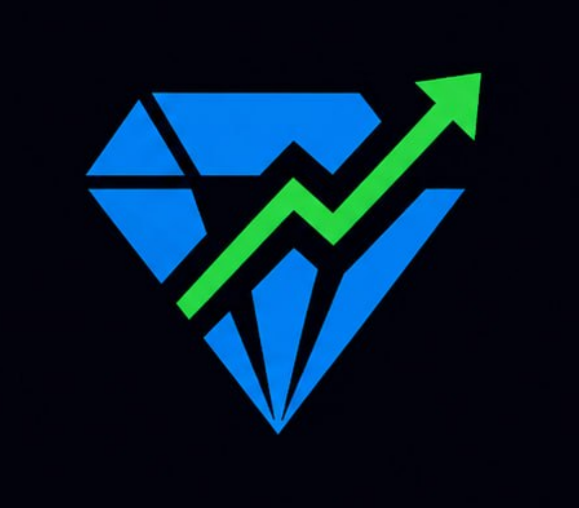
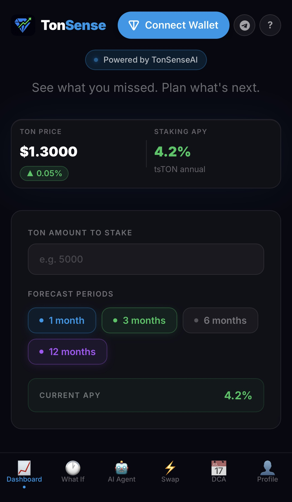
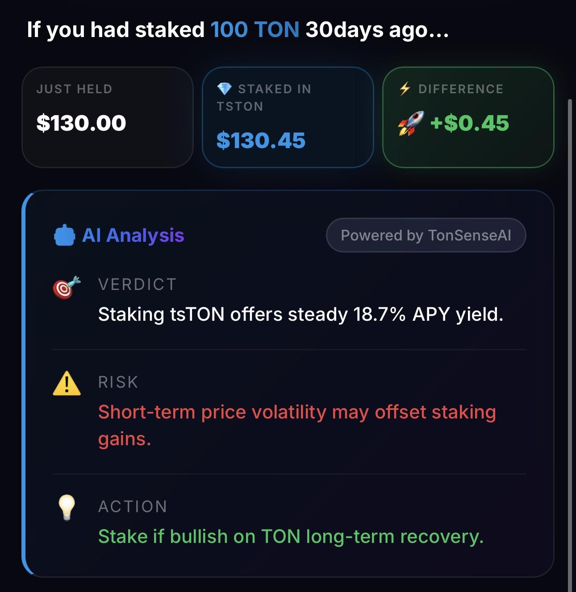
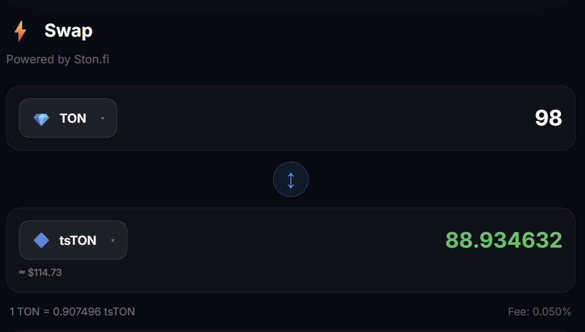
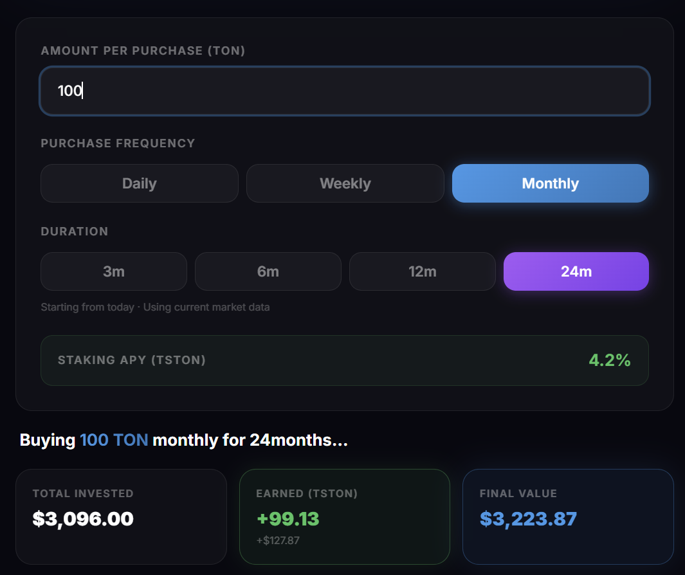
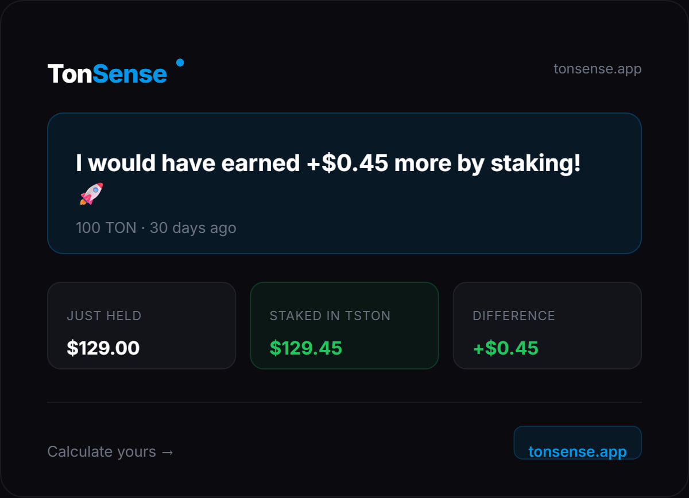
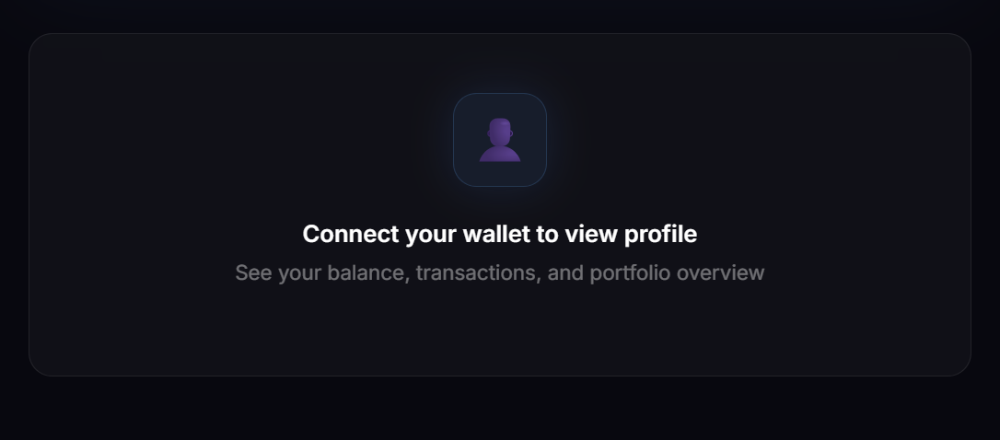
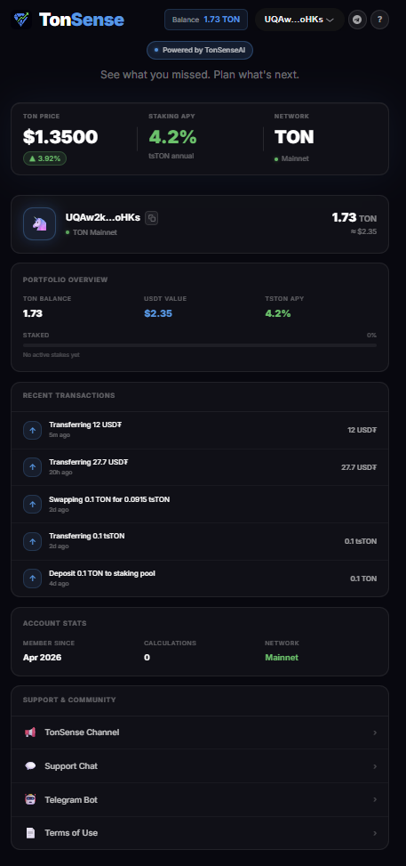

<div align="center">
  
  <h1>TonSense</h1>
  <p><strong>AI-powered DeFi dashboard for TON blockchain. Stake, swap, analyze — all in one place.</strong></p>

  [](https://tonsense.app)
  [](https://t.me/Ton_Sense_bot)
  [](LICENSE)
</div>

---

## Features

- **Dashboard** — Real-time TON price (24h change) and tsTON staking APY; AI Analysis card with verdict, risk, and action
- **What If Calculator** — FOMO analysis: see what you would have earned by staking N days ago, with AI Analysis
- **Future ROI Calculator** — Portfolio value over time chart with all four forecast periods (1, 3, 6, 12 months) overlaid simultaneously
- **AI Agent** — DeepSeek-powered DeFi advisor with live price, APY, and wallet context injected per message
- **Swap** — Multi-token swap via Ston.fi: TON, USDT, USDC, tsTON, NOT, SCALE — live rate simulation and on-chain execution
- **DCA Simulator** — Dollar cost averaging calculator with projected returns
- **Profile** — Wallet identity, TON balance, transaction history, and portfolio overview
- **Smart Alerts** — Telegram bot alerts when TON price or APY hits your target (Upstash Redis + Vercel Cron)
- **On-chain Staking** — Real Tonstakers transactions built and signed via TON Connect
- **Terms of Use** — Standalone legal page covering financial disclaimers, on-chain transaction responsibility, and third-party service disclosures

---

## Screenshots

| Dashboard | What If |
|---|---|
|  |  |

| AI Agent | Swap |
|---|---|
|  |  |

| DCA | Results |
|---|---|
|  |  |

| Profile | Profile (continued) |
|---|---|
|  |  |

| Transaction Preview |
|---|
|  |

---

## Tech Stack

| Layer | Technology |
|---|---|
| Framework | Next.js 16 App Router + TypeScript 5 |
| Styling | Tailwind CSS + Glassmorphism |
| Charts | Recharts |
| Wallet | TON Connect 2.0 |
| AI | DeepSeek API |
| On-chain | @ton/core — real Tonstakers transactions |
| DEX | Ston.fi SDK + simulate API |
| Price Data | CoinGecko API |
| Caching | Upstash Redis (price, APY, history — 60s/5m/1h TTL) |
| Alerts | Upstash Redis + Vercel Cron |
| Bot | Telegram Bot webhook (serverless) |
| Deploy | Vercel |

---

## Architecture

### System Context (C1)

Users interact with TonSense through two interfaces: a **web application** and a **Telegram bot**. Both provide the same core functionality.

| External System | Role |
|---|---|
| **TonAPI** | Provides tsTON/TON exchange rate. APY is computed by TonSense itself (`pool.total_amount / jetton.total_supply`) — Tonstakers is never called directly. |
| **DeepSeek API** | Powers two AI modes: structured JSON (verdict / risk / action) for the dashboard calculator; free-form DeFi chat on web and Telegram. |
| **Ston.fi API** | Swap simulation via `POST /v1/swap/simulate` with 500 ms debounce. Transactions built with `@ston-fi/sdk`, executed on-chain via the Ston.fi router contract. |
| **Telegram Platform** | Delivers bot responses via Bot API webhook at `/api/bot`. |
| **Tonkeeper** | User's wallet — signs and broadcasts all transactions via TON Connect. TonSense never submits transactions directly. |
| **TON Blockchain** | Executes staking (Tonstakers pool contract) and swaps (Ston.fi router contract). |

### Container Diagram (C2)

All containers are deployed on Vercel.

```
┌──────────────────────────────────────────────────────────┐
│                         Vercel                           │
│                                                          │
│  ┌──────────────────────┐   ┌──────────────────────────┐ │
│  │    Next.js App       │   │     Telegram Bot          │ │
│  │                      │   │   (webhook handler)       │ │
│  │  • Web UI            │   │                          │ │
│  │  • /api/* routes     │   │  • Shares all external   │ │
│  │    APY, AI, swaps,   │   │    integrations with     │ │
│  │    alerts, health    │   │    Next.js App            │ │
│  └─────────┬────────────┘   └──────────┬───────────────┘ │
│            │                           │                  │
│            └─────────────┬─────────────┘                  │
│                          │                                │
│                 ┌────────▼────────┐                       │
│                 │  Redis (Upstash)│                       │
│                 │  APY  — 5 min   │                       │
│                 │  Price — 1 min  │                       │
│                 │  History — 1 h  │                       │
│                 └─────────────────┘                       │
└──────────────────────────────────────────────────────────┘

┌──────────────────────────┐
│  User's Browser          │
│  TON Connect 2.0         │
│  Builds unsigned txs →   │
│  routes to Tonkeeper     │
└──────────────────────────┘
```

**Key decisions:**

- **Cache-first APY** — Redis → parallel TonAPI fallback (staking pool + jetton master endpoints).
- **Zero custody** — every write goes through the user's Tonkeeper wallet; TonSense holds no funds.
- **AI server-side only** — DeepSeek called exclusively from API routes, never from client components.
- **Same model, two prompts** — structured JSON for the dashboard calculator; free-form prose for the chat assistant.

---

## Environment Variables

| Variable | Description |
|---|---|
| `DEEPSEEK_API_KEY` | DeepSeek API key for AI responses |
| `TELEGRAM_BOT_TOKEN` | Telegram bot token from @BotFather |
| `KV_REST_API_URL` | Upstash Redis REST URL |
| `KV_REST_API_TOKEN` | Upstash Redis REST token |
| `CRON_SECRET` | Secret for authenticating Vercel Cron requests |

```bash
# .env.local
DEEPSEEK_API_KEY=your_key
TELEGRAM_BOT_TOKEN=your_token
KV_REST_API_URL=https://your-db.upstash.io
KV_REST_API_TOKEN=your_token
CRON_SECRET=your_secret
```

---

## Getting Started

```bash
git clone https://github.com/ArturPodchayev/TonSense
cd TonSense
npm install
cp .env.local.example .env.local  # fill in your keys
npm run dev
```

---

## Links

| | |
|---|---|
| 🌐 App | [tonsense.app](https://tonsense.app) |
| 🤖 Telegram Bot | [@Ton\_Sense\_bot](https://t.me/Ton_Sense_bot) |
| 📢 Channel | [@TonSense\_official](https://t.me/TonSense_official) |
| 💬 Support | [Support Chat](https://t.me/+ls8wv93nO9swYjli) |

---

## Built by

**Artur Podchaev** — developer
- 🌐 [arturpodchaev.uz](https://arturpodchaev.uz)
- 💼 [linkedin.com/in/arturpodchayev](https://linkedin.com/in/arturpodchayev)

**greejjddg09** — QA & testing · [GitHub](https://github.com/greejjddg09)

---

*Built for the TON ecosystem — evolved into a full DeFi dApp.*
